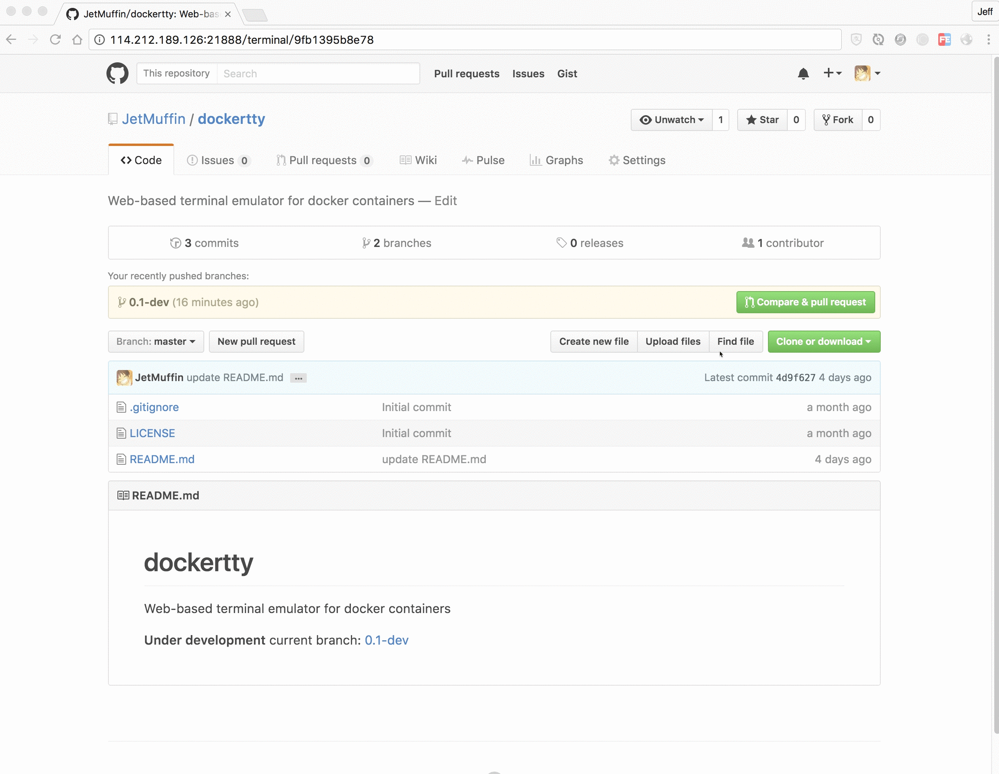

# dockertty

[](https://travis-ci.org/JetMuffin/dockertty)

DockerTTY is a Web-based terminal emulator for docker containers.



## Getting Started

DockerTTY is an agent to make it easier to connect to docker containers. You don't have to install `ssh-server` or other agent inside each container, or build special images. All you need to do is set it up on your server and visit it through your browser. 

### Prerequisities

- pip
- ptyprocess
- docker

### Installing

Firstly, clone the source code from github.

```
$ git clone https://github.com/JetMuffin/dockertty.git
```

Then, install dependency packages using pip.

```
$ cd dockertty
$ sudo pip install -r requirement.txt
```

### Usage

Run `python src/dockertty.py` with options. 

```
Usage: dockertty.py [options]

Options:
  -h, --help            show this help message and exit
  -p PORT, --port=PORT  Set port of dockertty listen to
  -l LOG_PATH, --log-path=LOG_PATH
                        Path to print log
```

By default, DockerTTY listen to port `21888` and output log to path `/var/log/dockertty.log`. 

So if you use default options to run, you may need root privillege (use `sudo` before the command). 

Then, open your browser, visit url below and enjoy yourself.

```
http://127.0.0.1:<port>/terminal/<container_id>
```

By the way, you can get the `container_id` by `docker ps`.

## Contributing

Issues and pull requests are wellcome!

Fork the [repository](https://github.com/JetMuffin/dockertty) on GitHub and send a pull request, or file an issue ticket at the [issue tracker](https://github.com/JetMuffin/dockertty/issues).

## Authors

* **JetMuffin** - *Initial work* - [JetMuffin](https://www.jetmuffin.com)

## License

MIT License
# docker-tty
